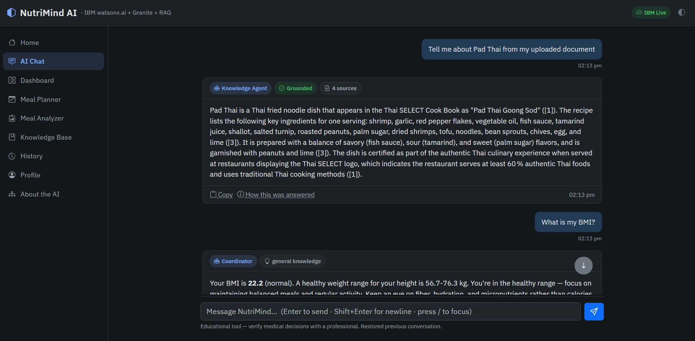
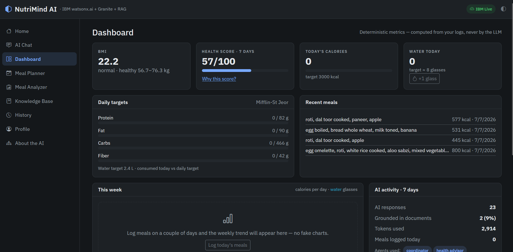
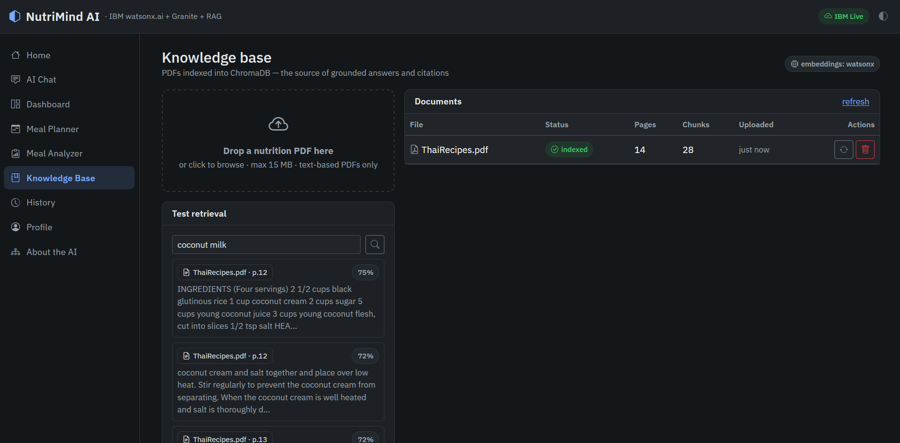

# NutriMind AI

**AI-Powered Nutrition Assistant · IBM watsonx.ai · Granite · RAG · Specialist Agents with Deterministic Routing**

[](https://github.com/datapiratepy/NutriMind-AI/actions/workflows/ci.yml)


NutriMind AI is a nutrition assistant built for the IBM SkillsBuild +
Edunet Foundation internship. A Coordinator routes every request to one of
four specialist agents; factual answers are grounded in your own nutrition PDFs
with page-level citations; and every number the app shows — calories, BMI, macro
targets, health score — is computed deterministically in Python, never by the LLM.

> **On the word "agent."** Each of the four specialists is an agent in the sense
> that it encapsulates a role, its own version-controlled system prompt, and its own
> tools, and streams a typed event protocol. Routing between them is **deterministic
> rules first**, with a Granite JSON classification step only for messages no rule
> matches. There is **no autonomous planning loop** — no ReAct-style
> reason/act/observe cycle, no self-directed tool selection, no inter-agent
> negotiation. The accurate description is *specialist agents with deterministic
> routing and an LLM classification fallback*. See [Routing](#routing-what-selects-an-agent)
> below and [docs/AGENTS.md](docs/AGENTS.md).

> **Runs with zero setup.** Without IBM credentials the app starts in a fully
> functional demo mode; with an IBM Cloud Lite account it uses live Granite
> models through the official watsonx.ai SDK.

## Screenshots

| Chat with agent metadata | Dashboard | Knowledge base |
|---|---|---|
|  |  |  |

## Key features

**Agentic AI** — a Coordinator classifies each request (deterministic rules
first, Granite JSON classification only for ambiguous cases) and routes it to
the Knowledge, Meal Planner, Meal Analyzer or Health Advisor agent. Every
response shows which agent answered, the routing reason, and the exact tools
that ran.

**RAG with honest grounding** — upload nutrition PDFs; they are chunked
(page-bounded, overlapping: 800 chars with 120-char overlap), embedded, and indexed
in ChromaDB (cosine, top-k 5). Indexing runs in the background — the upload
returns immediately and the page reports progress — because a 400-page document
takes 12s on the built-in provider and far longer against watsonx. Answers above
the provider's similarity threshold cite sources by filename and page; anything
else is visibly labeled *general knowledge*. No invented evidence, ever.

**Deterministic nutrition engine** — Mifflin-St Jeor BMR/TDEE, macro targets,
an 85-food curated composition table (Indian + international, Hindi aliases,
micronutrients), WHO BMI categories, and an explainable 0-100 health score
whose five components are shown with their reasons.

**Multi-user by construction** — email/password accounts with session cookies;
every profile, meal, plan, chat and document belongs to exactly one account,
enforced by foreign keys and by an ownership filter on vector retrieval so one
user's questions can never be grounded in another's documents.

**Product-grade UX** — streaming chat (SSE) with live progress, an AI workflow
panel built from response metadata, dark/light themes, dashboard with
dependency-free trend charts, drag-and-drop document management with retrieval
preview, wizard profile with live BMI, and branded PDF export of meal plans.

## Architecture

```
Browser (Bootstrap 5 · SSE · vanilla JS)
        │
Flask API (blueprints · validation · JSON error envelope · request IDs)
        │
Coordinator Agent ──► Knowledge │ Meal Planner │ Meal Analyzer │ Health Advisor
        │                    │            │             │            │
        │              Retriever   Nutrition Svc   Food Table   Retriever+Targets
        │                    │            │             │            │
LLMClient (watsonx.ai Granite ⇄ deterministic demo engine)
        │
ChromaDB (per-provider collections) · SQLite · curated food CSV
```

Rendered diagrams (system, routing, RAG, database, request & chat flows):
[ARCHITECTURE_DIAGRAMS.md](docs/ARCHITECTURE_DIAGRAMS.md)

Deep dives: [ARCHITECTURE.md](docs/ARCHITECTURE.md) ·
[AGENTS.md](docs/AGENTS.md) · [FRONTEND.md](docs/FRONTEND.md) ·
[IMPLEMENTATION_NOTES.md](docs/IMPLEMENTATION_NOTES.md)

## Getting started

```bash
git clone https://github.com/datapiratepy/NutriMind-AI.git
cd NutriMind-AI

# Create a virtual environment
python -m venv .venv

# Activate it
# Windows
.venv\Scripts\activate

# Linux/macOS
# source .venv/bin/activate

pip install -r requirements.txt

python run.py
```
Open **http://127.0.0.1:5000** in your browser.

By default, NutriMind AI starts in **Demo Mode**, providing deterministic AI responses and a fully functional RAG pipeline so that every feature can be explored without IBM credentials.

To enable **IBM Live Mode** with Granite foundation models, follow the instructions in **docs/IBM_SETUP.md**.

### Routing — what selects an agent

`Coordinator.route()` (`nutrimind/agents/coordinator.py`) has exactly two stages:

1. **Deterministic rules — 0 tokens.** An ordered table of six regex rules; first
   match wins. Two of them (`Small Talk`, `BMI Check`) the Coordinator answers
   *itself*, with no LLM call at all — BMI is arithmetic, so it is computed in
   Python.
2. **Granite JSON classification — only if no rule matched.** The message goes to
   Granite with a strict-JSON prompt at `temperature=0.0`, `max_tokens=80`; the
   returned agent id is validated against the allow-list. Any failure falls back to
   the default agent — routing never raises.

**In demo mode stage 2 is skipped entirely** (the demo backend cannot classify
arbitrary text), so unmatched messages fall through to the Knowledge Agent with
`method: "default"` and a reason string that says so.

Every decision carries `intent`, `agent`, `reason` and `method`
(`rules` | `llm` | `default`), returned in the API response and rendered in the UI
badge — so the routing path is always visible, never inferred.

### Embedding provider matrix

Three providers, resolved by `EMBEDDINGS_PROVIDER` (`nutrimind/retrieval/embeddings.py`):

| Provider | Model | Dim | Semantic? | Selected when |
|---|---|---|---|---|
| `watsonx` | `ibm/granite-embedding-278m-multilingual` | 768 | yes | `EMBEDDINGS_PROVIDER=watsonx`, or `auto` **with** IBM credentials |
| `local` | `sentence-transformers/all-MiniLM-L6-v2` | 384 | yes | `EMBEDDINGS_PROVIDER=local`, or `auto` with no credentials **and** `sentence-transformers` installed |
| `lexical` | hashing trick over word tokens (signed, sublinear TF) | 2048 | keyword only | `auto`, no credentials, `sentence-transformers` **not** installed |

`sentence-transformers` is **commented out** in `requirements.txt` (it pulls
PyTorch), so a default install with no IBM credentials resolves to **`lexical`**.

**Be clear about what the lexical provider is:** it is keyword search expressed as
vectors — the hashing trick over word tokens, with signed buckets so collisions
cancel rather than accumulate. It finds passages that *share words* with your
question, so uploading a cookbook and asking for "pad thai" works. It cannot
connect "aubergine" to "eggplant"; that needs a real embedding model. It exists so
the full pipeline — ingest → chunk → embed → index → search → threshold → cite —
is genuinely usable with zero credentials and zero heavy dependencies. It is never
selected silently: resolution logs a warning, `/api/system/info` reports it, every
chat response carries `meta.embedding_provider`, and the search UI says plainly
when a miss is due to keyword-only matching.

**Similarity thresholds belong to a vector space, not to the application.** A short
query against a long chunk cannot reach the same cosine in a sparse lexical space
as in a dense semantic one, so each provider supplies its own default (semantic
0.35, lexical 0.12, both overridable with `RAG_SIMILARITY_THRESHOLD`). Applying one
number to both is how "retrieval returns nothing" happens.

Each provider gets **its own Chroma collection** (`kb_watsonx`, `kb_local`,
`kb_lexical`) because the vector spaces are not comparable — a 384-dim hash vector must
never be searched against 768-dim Granite vectors.

**What does *not* change between modes:** chunking, the vector store, the
similarity threshold, citation construction, the SSE event protocol, and every
nutrition calculation (BMR/TDEE, macros, BMI, health score) — those are pure Python
and identical in both modes.

### IBM Live mode

1. Follow **[docs/IBM_SETUP.md](docs/IBM_SETUP.md)** (IBM Cloud Lite account,
   watsonx.ai project, IAM API key — ~20 minutes, no credit card).
2. `copy .env.example .env` and fill in your credentials.
3. Verify: `python scripts/check_watsonx.py` (color-coded connectivity check,
   validates your model IDs against the live catalog).
4. Seed the knowledge base: `python scripts/seed_knowledge_base.py` after
   placing nutrition PDFs in `knowledge_base/`.

### Environment variables

All configuration is environment-driven (see [.env.example](.env.example)):
`WATSONX_APIKEY`, `WATSONX_PROJECT_ID`, `WATSONX_URL`, `WATSONX_MODEL_ID`,
`WATSONX_EMBEDDING_MODEL_ID`, `APP_MODE` (live/demo/auto),
`EMBEDDINGS_PROVIDER`, `FLASK_SECRET_KEY`, `MAX_UPLOAD_MB`, and RAG tuning
(`RAG_CHUNK_SIZE`, `RAG_CHUNK_OVERLAP`, `RAG_TOP_K`,
`RAG_SIMILARITY_THRESHOLD`). Secrets live only in `.env` (git-ignored).

## Testing

```bash
pip install -r requirements.txt -r requirements-dev.txt
pytest tests/ -q                                   # 303 tests
pytest tests/ --cov=nutrimind --cov-report=term    # ~89% coverage
ruff check .                                       # lint, as CI runs it
```

The suite runs entirely in demo mode — no API keys required — and covers the
deterministic services, models, RAG pipeline, agents, routing rules, chat SSE
protocol, configuration defaults, PDF export, authentication, and — most
importantly — that no account can reach another account's data.

CI runs on every push (GitHub Actions): ruff, then the suite with a coverage
floor, then an advisory `pip-audit` of the pinned dependencies.

**Test isolation:** the suite must never pick up a real `.env`. `load_settings()`
calls `load_dotenv(..., override=False)`, which protects variables already present in
the environment but *repopulates ones a test deleted* — so tests that clear
`WATSONX_APIKEY`/`WATSONX_PROJECT_ID` to exercise the credential-free path would
otherwise get live credentials back and resolve to the watsonx provider. A
session-scoped autouse fixture in `tests/conftest.py` neutralises the `.env` read and
clears the credential variables, so the suite behaves identically in CI, in a fresh
clone, and on a configured developer machine.

**Intentionally uncovered:** `watsonx_client.py` network paths (the pure logic
is tested; live calls are exercised by `scripts/check_watsonx.py` against real
credentials), the optional `sentence-transformers` provider, and the live-mode
branches of the LLM factory. CI enforces a coverage floor of 88% — a ratchet
against erosion rather than a target to chase.

> Note: `chromadb` is required to run the suite — roughly 30 tests construct a
> `VectorStore`. Without it those tests fail with
> `ConfigurationError: ChromaDB is not installed`. Install the full
> `requirements.txt` before running.

## Folder structure

```
nutrimind/          application package
  agents/           coordinator + 4 specialists + tools
  services/         llm/ (watsonx + demo) · rag · nutrition · bmi · score · export
  retrieval/        chunker · embeddings · vector store · ingestion · retriever
  models/ routes/ prompts/ utils/ templates/ static/
knowledge_base/     seed PDFs (indexed by scripts/seed_knowledge_base.py)
instance/           runtime data (SQLite, uploads, ChromaDB, secret_key) — git-ignored
scripts/ tests/ docs/
```

Full map with rationale: [docs/FOLDER_STRUCTURE.md](docs/FOLDER_STRUCTURE.md)

## Technology stack

Python 3.13 (supported 3.11–3.14) · Flask 3 · SQLAlchemy 2 · **ibm-watsonx-ai** (Granite 4 chat +
Granite embeddings) · ChromaDB · pypdf · ReportLab · Bootstrap 5.3 · vanilla
JS (no build step) · pytest

## Documentation

| Doc | Purpose |
|---|---|
| [ARCHITECTURE.md](docs/ARCHITECTURE.md) | System design and the reasoning behind it |
| [AGENTS.md](docs/AGENTS.md) | Agent contracts and the streaming event protocol |
| [INSTALLATION.md](docs/INSTALLATION.md) | Local setup |
| [IBM_SETUP.md](docs/IBM_SETUP.md) | Zero-to-connected IBM walkthrough |
| [DEPLOYMENT.md](docs/DEPLOYMENT.md) | Why the deployment is shaped the way it is |
| [RUNBOOK.md](docs/RUNBOOK.md) | Deploy, upgrade, roll back, back up, restore, troubleshoot |
| [IMPLEMENTATION_NOTES.md](docs/IMPLEMENTATION_NOTES.md) | Decisions and trade-offs made during the build |
| [MANUAL_TESTING.md](docs/MANUAL_TESTING.md) | Step-by-step verification guide |
| [RELEASE_NOTES.md](docs/RELEASE_NOTES.md) | v1.0 summary, limitations, roadmap |

Internship submission material (presentation, demo script, checklists) is kept
for provenance in [docs/archive/](docs/archive/).

## Deployment

The production stack is a container behind Caddy with one data volume:

```bash
cp .env.example .env          # set FLASK_SECRET_KEY and NUTRIMIND_DOMAIN
docker compose build
docker compose run --rm migrate      # schema changes are an explicit step
docker compose up -d
```

Caddy obtains and renews the TLS certificate automatically. Migrations never run
from the app container, so a restart loop cannot re-run a failing migration
against live data. Full procedures — upgrade, rollback, backup, restore,
troubleshooting — are in [RUNBOOK.md](docs/RUNBOOK.md).

## Future improvements

Weekly PDF reports · retrieval reranking for large knowledge bases · vendored UI
assets for offline demos · threshold auto-tuning against live embeddings ·
security headers (CSP, HSTS, SRI) · error tracking and uptime monitoring ·
transactional email for password resets.

## License

[MIT](LICENSE) © 2026 Harsh Kamat · Educational project — not medical advice.
