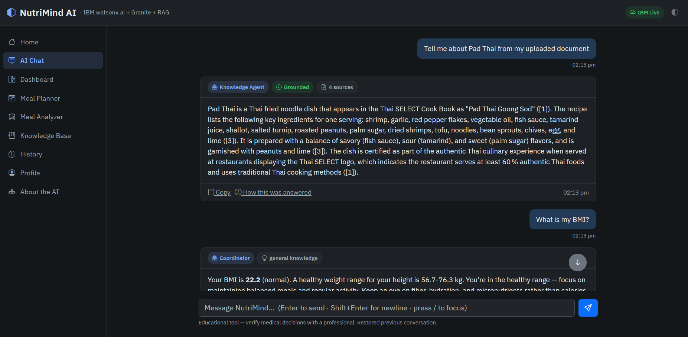
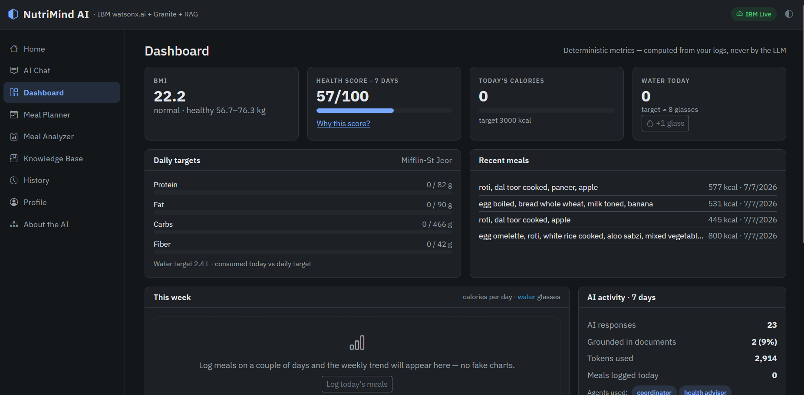
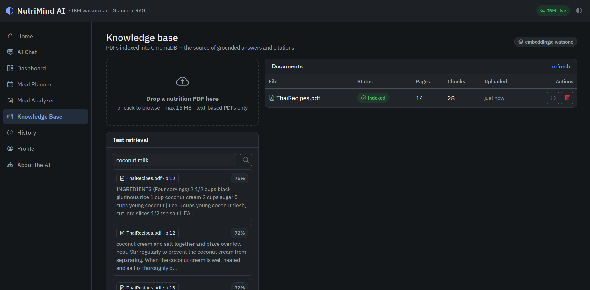

# NutriMind AI

A multi-user nutrition assistant that answers questions from each user's own documents.
It uses retrieval-augmented generation (RAG) on IBM watsonx.ai Granite models, routes
each request to one of four specialist agents with deterministic rules first, and computes
every number it shows (calories, BMI, macro targets, health score) in Python rather than
asking the model.

[](https://github.com/datapiratepy/NutriMind-AI/actions/workflows/ci.yml)


**Live demo:** <https://nutrimind-ai-0rby.onrender.com>, running in IBM Live mode on
watsonx.ai Granite (the instance reports its mode at `/api/health`). It is a public demo:
don't upload personal health documents, and treat anything stored there as disposable.

| | |
|---|---|
| **What it does** | Chat grounded in your uploaded PDFs, with page-level citations · meal planning with PDF export · free-text meal analysis · dashboard with an explainable health score |
| **AI / retrieval** | IBM watsonx.ai (Granite 4 chat, Granite embeddings) · ChromaDB · rule-first routing with a Granite classification fallback |
| **Backend** | Flask 3 · SQLAlchemy 2 · Alembic migrations · SQLite or PostgreSQL · Waitress · Docker |
| **Evidence** | 472 automated tests at 91% line coverage · CI on every push: lint, test suite, migrations on a real PostgreSQL server, and a production-image boot check |
| **Status** | `v2.0.0` tagged · deployed on Render · single-process by design · known gaps listed under [Limitations](#limitations) |

The project began as an IBM SkillsBuild internship deliverable (with Edunet Foundation)
and was then taken through five engineering milestones: migrations, authentication and
per-user isolation, asynchronous ingestion, deployment, and security hardening. Each
milestone added its own regression tests.

## Screenshots

| Chat: streamed, with routing and citation metadata | Dashboard: trends and explainable health score | Knowledge base: upload, async indexing, retrieval preview |
|---|---|---|
|  |  |  |

## Design principles

- **Citations are built in code, not generated.** The citation list comes from stored chunk
  metadata (file name and page), so the model cannot invent a source. Answers that no
  retrieved passage supports are labelled *general knowledge*.
- **The model never does the arithmetic.** BMR/TDEE (Mifflin-St Jeor), macro targets, WHO
  BMI categories, meal totals from an 85-food composition table, and the five-component
  health score are deterministic Python.
- **Isolation is enforced at the data layer.** Every owned row has a `user_id`, and vector
  search is restricted to document ids resolved from the database first, because the
  vector store itself has no notion of users.
- **Every decision is visible.** Each response carries the routing decision (`rules`,
  `llm` or `default`), the tools that ran, the embedding provider, and whether the answer
  was grounded. The UI shows all of it.

## Architecture

```
TLS proxy (Caddy in the Docker Compose stack; the platform edge on Render)
        │
Waitress: one process, 8 threads (wsgi:app)
        │
Flask API: auth · CSRF · validation · JSON errors · request IDs · security headers + CSP nonce
        │
Coordinator ──► Knowledge │ Meal Planner │ Meal Analyzer │ Health Advisor
        │           │            │              │              │
        │       Retriever   Nutrition svc    Food table    Retriever + targets
        │
LLM client: watsonx.ai Granite  ⇄  deterministic demo backend
        │
        ├── background job pool ──► ingestion: extract · chunk · embed · index
        │
ChromaDB (one collection per embedding provider) · SQLite/PostgreSQL · food CSV
```

**One process, many threads, deliberately.** ChromaDB caches its vector-index reader per
process, so a second worker process reports the right chunk count and then finds nothing
when it searches, with no error. The app takes an advisory lock on the vector-store
directory at startup and logs an explanation if a second process appears. The
measurements behind this are in [DEPLOYMENT.md](docs/DEPLOYMENT.md#production-process-model).

More detail: [ARCHITECTURE.md](docs/ARCHITECTURE.md) ·
[diagrams](docs/ARCHITECTURE_DIAGRAMS.md) · [AGENTS.md](docs/AGENTS.md)

### Routing

`Coordinator.route()` in [`nutrimind/agents/coordinator.py`](nutrimind/agents/coordinator.py)
has two stages:

1. **Deterministic rules (no tokens).** Six ordered regex rules; the first match wins.
   Small talk and BMI checks are answered by the Coordinator itself with no LLM call.
2. **Granite JSON classification**, only when no rule matches: `temperature=0`,
   `max_tokens=80`, and the returned agent id is checked against an allow-list. Any
   failure falls back to the Knowledge agent, so routing never raises. Demo mode skips
   this stage and says so in the routing reason.

The four "agents" are role-specific handlers, each with its own version-controlled prompt
and tools (retrieval, nutrition targets, food lookup, BMI, meal logging). There is no
autonomous planning loop: no ReAct-style cycle and no self-directed tool selection.

### Retrieval pipeline

Upload → validate by content → extract text (pypdf) → page-bounded overlapping chunks
(800 characters, 120 overlap) → embed → index in ChromaDB (cosine) → retrieve top 5 →
apply the provider's similarity threshold → cite by file and page.

Indexing runs on a bounded background pool: the upload returns `202 Accepted`, and the
document moves through `pending → processing → indexed | failed`, which the UI polls.
Work interrupted by a restart is recovered at startup.

Three embedding providers, chosen by `EMBEDDINGS_PROVIDER`:

| Provider | Model | Dim | Semantic? | Selected when |
|---|---|---|---|---|
| `watsonx` | `ibm/granite-embedding-278m-multilingual` | 768 | yes | IBM credentials present (or set explicitly) |
| `local` | `sentence-transformers/all-MiniLM-L6-v2` | 384 | yes | no credentials and the optional `sentence-transformers` package installed |
| `lexical` | hashing trick over word tokens | 2048 | keyword only | no credentials and no `sentence-transformers` (the default install) |

The lexical provider is keyword search expressed as vectors. It lets the whole pipeline
run with no credentials, but it cannot match synonyms, and it is never selected silently:
the startup log, `/api/system/info` and every chat response report the active provider.
Each provider has its own collection and its own similarity threshold (0.35 semantic,
0.12 lexical), because thresholds belong to a vector space, not to the app.

Retrieved passages are fenced as untrusted data before they reach the model, and the
fence markers are neutralised inside passage text. This mitigates prompt injection from
uploaded documents; it does not solve it (see [SECURITY.md](SECURITY.md)).

## Security and privacy

A summary; the full policy, including what is **not** implemented, is in
[SECURITY.md](SECURITY.md), and data handling is in [PRIVACY.md](PRIVACY.md).

- **Accounts:** scrypt password hashing, NIST-style length rules, sessions invalidated on
  password change, signed single-use reset links, and no account enumeration.
- **Per-user isolation:** `user_id` on every owned table, one chokepoint for the current
  user, default-deny access control per blueprint, and "does not exist" rather than 403
  for other users' records. A dedicated tenancy suite checks both directions, including
  vector search.
- **Web hardening:** CSRF on every state-changing endpoint; `Secure`/`HttpOnly`/`SameSite`
  cookies; nonce-based Content-Security-Policy with no `'unsafe-inline'` scripts; HSTS,
  frame, referrer, permissions and cross-origin headers. Third-party UI assets are
  vendored into the repository, so the CSP allows no external origin.
- **Abuse resistance:** uploads validated by content (header, trailer and a structural
  parse), per-account storage quota, and rate limits on authentication, chat, upload and
  account endpoints with a bounded tracking table and IPv6 /64 grouping.
- **Privacy-aware logging:** messages, search queries and email addresses are replaced
  by a length and a salted fingerprint; secrets are never logged.
- **Account lifecycle:** export everything as JSON, or delete the account, which removes
  database rows, uploaded files and vector embeddings.

## Testing and CI

```bash
pip install -r requirements.txt -r requirements-dev.txt
pytest tests/ -q                                  # 472 tests
pytest tests/ --cov=nutrimind --cov-report=term   # 91% line coverage
ruff check .
```

Measured at commit `d70ae9b` on Python 3.13 in demo mode: **472 passed** (274 unit,
198 integration) and **91% line coverage**, with ruff clean. The suite needs no API keys.

CI ([`ci.yml`](.github/workflows/ci.yml)) runs three jobs on every push:

1. **Lint, tests, audit:** ruff, the full suite with an 88% coverage floor, and an advisory
   `pip-audit`.
2. **Migrations on PostgreSQL:** applies the Alembic migrations to a real PostgreSQL 16
   server and asserts the schema matches the models.
3. **Production image:** builds the Docker image, asserts it runs as a non-root user,
   applies migrations inside it, boots it, waits for `/api/health`, and checks that it
   stops cleanly on SIGTERM.

What each suite pins (tenancy, upload validation, rate-limit bounds, log privacy, security
headers, account lifecycle, timezones, migrations, concurrency), what is deliberately not
covered, and how the suite is isolated from a local `.env`:
[docs/TESTING.md](docs/TESTING.md).

## Deployment

**Public demo on Render.** [`scripts/render_start.sh`](scripts/render_start.sh) applies
database migrations, then starts Waitress on the platform's `$PORT` as one process with
eight threads.

**Self-hosted stack.** The repository also ships the infrastructure to run it on your own
server: a multi-stage Docker image with a non-root runtime, Docker Compose with Caddy
(automatic TLS, HTTP/3, unbuffered streaming for `/api/chat`), migrations as an explicit
deploy step, `scripts/backup.sh` / `scripts/restore.sh` (SQLite online-backup API), and a
graceful SIGTERM drain for in-flight indexing.

```bash
cp .env.example .env          # set FLASK_SECRET_KEY and NUTRIMIND_DOMAIN
docker compose build
docker compose run --rm migrate
docker compose up -d
```

Two constraints apply everywhere: run **one** application process (use threads, not
workers), and give it **persistent storage** for the database, uploads and vector index.
Procedures: [RUNBOOK.md](docs/RUNBOOK.md). Reasoning: [DEPLOYMENT.md](docs/DEPLOYMENT.md).

## Run it locally

```bash
git clone https://github.com/datapiratepy/NutriMind-AI.git
cd NutriMind-AI
python -m venv .venv
.venv\Scripts\activate          # Windows; on Linux/macOS: source .venv/bin/activate
pip install -r requirements.txt
python run.py                   # applies migrations, then serves http://127.0.0.1:5000
```

With no IBM credentials it starts in **demo mode**: a deterministic stand-in for the LLM
and the lexical embedding provider, so every feature can be explored offline. For
**IBM Live mode** with Granite, follow [docs/IBM_SETUP.md](docs/IBM_SETUP.md) (IBM Cloud
Lite account, watsonx.ai project, API key), copy `.env.example` to `.env`, and verify the
connection with `python scripts/check_watsonx.py`. All configuration is environment-driven;
see [`.env.example`](.env.example).

## Limitations

Stated plainly, because they matter more than the feature list:

- **Password reset links are written to the application log, not emailed**, and email
  addresses are not verified. Self-service reset does not work without a mail transport.
- **Single process only.** Horizontal scaling needs ChromaDB moved out of the application
  process; the in-memory rate limiter also resets on restart.
- **No error tracking, alerting or uptime monitoring.** Failures are logged; nobody is
  notified. Backups are local unless you copy them off-host.
- **Prompt injection is mitigated, not solved.** Today retrieval is scoped to the caller's
  own documents, so the exposure is self-injection.
- **Live watsonx.ai calls are not exercised in CI.** The suite runs in demo mode; the live
  path is checked by `scripts/check_watsonx.py` against real credentials.
- **Scanned (image-only) PDFs are not supported**: there is no OCR step.
- NutriMind gives general nutrition information and is **not medical advice**.

## Release history

| Tag | Focus |
|---|---|
| `v1.1.0-milestone1` | Safer configuration defaults, pinned dependencies, CI quality gates |
| `v1.2.0-milestone2` | Alembic migrations, PostgreSQL compatibility, safe adoption of pre-existing databases |
| `v1.3.0-milestone3` | Accounts, per-user ownership and isolation, CSRF on the JSON API |
| `v1.4.0-milestone4` | Asynchronous ingestion, background jobs, single-process runtime guard, interrupted-work recovery |
| `v1.5.0-milestone5` | Docker, Compose, Caddy, WSGI entry point, backup/restore, cookie hardening, graceful shutdown |
| `v2.0.0` | Abuse resistance, security headers and CSP, prompt-injection fencing, privacy-aware logging, account export/deletion, timezones |

The milestone commit messages record what each audit found, how it was measured, and the
evidence that the fix worked.

## Documentation

| Document | Purpose |
|---|---|
| [ARCHITECTURE.md](docs/ARCHITECTURE.md) | System design and the reasoning behind it |
| [AGENTS.md](docs/AGENTS.md) | Agent contracts and the streaming event protocol |
| [TESTING.md](docs/TESTING.md) | What the test suites pin, coverage exclusions, CI jobs |
| [DEPLOYMENT.md](docs/DEPLOYMENT.md) | Process model, proxy, persistence and migration decisions |
| [RUNBOOK.md](docs/RUNBOOK.md) | Deploy, upgrade, roll back, back up, restore, troubleshoot |
| [SECURITY.md](SECURITY.md) · [PRIVACY.md](PRIVACY.md) | What is protected, what is not, and what data is kept |
| [INSTALLATION.md](docs/INSTALLATION.md) · [IBM_SETUP.md](docs/IBM_SETUP.md) | Local setup and enabling watsonx.ai |
| [IMPLEMENTATION_NOTES.md](docs/IMPLEMENTATION_NOTES.md) | Decisions and trade-offs from the original build phases |
| [MANUAL_TESTING.md](docs/MANUAL_TESTING.md) | Manual verification walkthrough (written before accounts were added) |
| [FOLDER_STRUCTURE.md](docs/FOLDER_STRUCTURE.md) | Repository map |
| [RELEASE_NOTES.md](docs/RELEASE_NOTES.md) | v1.0.0 release notes (historical) |

Material from the original internship submission is kept in [docs/archive/](docs/archive/)
for provenance; it describes v1.0, not the current application.

## License

[MIT](LICENSE) © 2026 Harsh Kamat
