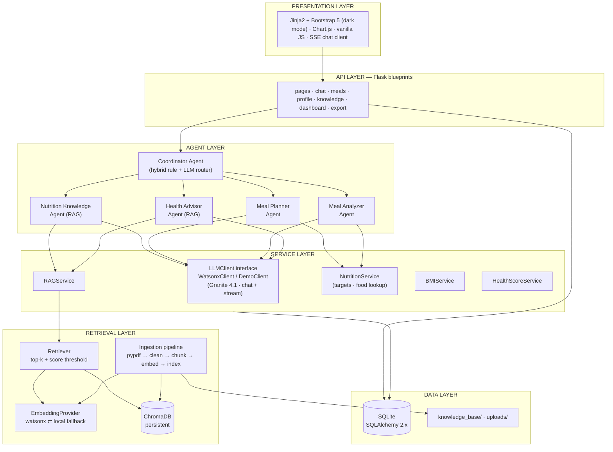
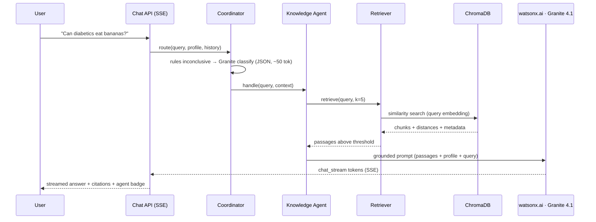

# NutriMind AI — System Architecture

**AI-Powered Nutrition Assistant using IBM watsonx.ai, Granite and RAG**

| | |
|---|---|
| Version | 1.0 (Phase 1 deliverable) |
| Status | Awaiting approval |
| Author | Harsh |
| Date | 2026-07-06 |
| Program | IBM SkillsBuild + Edunet Foundation Internship |

---

## 1. Overview

NutriMind AI is a multi-agent nutrition assistant. It is explicitly **not** a single-prompt chatbot: user requests flow through a **Coordinator Agent** that routes them to one of four specialized agents, each with its own system prompt, tools, and grounding strategy. Factual nutrition answers are produced through **Retrieval-Augmented Generation (RAG)** over a user-extendable knowledge base of nutrition PDFs (WHO/USDA/ICMR guidelines, food composition tables, condition-specific guides).

Core capabilities: personalized meal planning, nutrition Q&A with citations, free-text meal analysis with macro estimates, condition-aware health guidance (11 supported conditions), BMI tracking, and a dashboard with progress charts and a computed health score.

### Architecture principles

1. **LLM for language, Python for math.** Calorie targets, BMR, BMI, macro totals, and health scores are computed deterministically. Granite writes plans, explanations and assessments *around* verified numbers — never invents them.
2. **Grounded before generative.** Knowledge and health agents retrieve from the vector store first; answers cite sources (document + page). When retrieval confidence is below threshold, the answer is explicitly labeled as general knowledge.
3. **Provider-agnostic AI boundary.** All LLM/embedding access goes through one interface with two implementations: `WatsonxClient` (live) and `DemoClient` (deterministic). The app runs end-to-end with zero credentials — critical for evaluation, testing, and demo resilience.
4. **Token-budget aware.** IBM Cloud Lite allows ~300,000 inference tokens/month. Routing uses cheap rules before an LLM call, embeddings are cached by content hash, and every agent has a `max_new_tokens` cap. Token usage is logged per request.
5. **Clean layering.** Presentation → API → Agents → Services → Retrieval/Data. Dependencies point downward only; no layer skips.

---

## 2. Layered Architecture



### Layer responsibilities

| Layer | Owns | Never does |
|---|---|---|
| Presentation | Templates, static assets, charts, SSE consumption | Business logic, API calls to IBM |
| API (Flask blueprints) | HTTP concerns: validation, sessions, status codes, SSE | Prompting, retrieval, math |
| Agents | Prompts, routing, tool orchestration, response shaping | Direct DB/HTTP access (goes via services) |
| Services | watsonx SDK calls, RAG orchestration, nutrition math, scores | Rendering, request parsing |
| Retrieval | PDF ingestion, chunking, embeddings, vector search | Answer generation |
| Data | SQLAlchemy models, ChromaDB persistence, file storage | Everything else |

Cross-cutting (used by all layers): `config` (env-driven), `logging`, `exceptions`, `validators`.

---

## 3. Agentic AI Design

### 3.1 Coordinator Agent — hybrid router

Routing is two-stage to conserve Lite-tier tokens and cut latency:

1. **Rule stage (0 tokens):** deterministic patterns catch high-confidence intents — "today I ate / analyze" → Analyzer; "meal plan / diet plan / calories plan" → Planner; "bmi / ideal weight" → BMI tool; condition keywords (diabetes, BP, pregnancy…) + advice phrasing → Health Advisor; greetings/small talk → short direct reply.
2. **LLM stage (~50 output tokens):** ambiguous queries go to Granite with a strict classification prompt returning JSON `{"agent": "...", "reason": "..."}`. Invalid JSON → one retry → fallback to Knowledge Agent.

Every routing decision (stage, agent, reason) is logged and surfaced in the UI as an **agent badge with tooltip** — evaluators can *see* the agentic behavior.

The Coordinator also assembles shared context for the chosen agent: user profile summary, last N chat turns, and computed targets.

### 3.2 Specialist agents

| Agent | Grounding | Tools used | Output |
|---|---|---|---|
| **Nutrition Knowledge** | RAG-first: retrieve top-5 chunks; below threshold → labeled general-knowledge answer | `retrieve_knowledge` | Answer + citations (doc, page) |
| **Meal Planner** | Profile + deterministic targets (Mifflin-St Jeor BMR × activity ± goal); Granite fills a strict JSON meal-plan schema honoring cuisine (Indian/international), allergies, conditions | `calculate_targets`, `retrieve_knowledge` (condition constraints) | Validated plan JSON → rendered cards; macros/fiber/water/micros per day |
| **Meal Analyzer** | Two-pass: (1) Granite extracts structured food items + quantities from free text, (2) local food-composition table computes calories/protein/fat/carbs/fiber, (3) Granite writes qualitative assessment + suggestions grounded in those numbers | `lookup_foods`, `log_meal` | Per-item + total macros, quality score, suggestions |
| **Health Advisor** | RAG over condition-tagged documents + profile; 11 conditions (diabetes, heart disease, hypertension, weight loss/gain, muscle building, healthy eating, pregnancy, child, senior, sports) | `retrieve_knowledge`, `calculate_targets` | Condition-aware guidance + citations + safety framing |

All agents inherit `BaseAgent` (name, system prompt, tool registry, `run(query, context) → AgentResponse{content, sources, agent, meta}`). Tools are plain typed Python functions the agent orchestration invokes — honest agentic design, no invented IBM orchestration APIs.

### 3.3 Safety constraints (all agents)

Educational framing, never diagnosis or medication advice; red-flag symptoms → advise consulting a professional; allergies from the profile are hard constraints in planning; every prompt includes the constraint block (Phase 6 defines exact prompts with role, responsibilities, constraints, examples, reasoning strategy).

## 4. RAG Pipeline

### 4.1 Ingestion (upload → searchable)

Ingestion is split across the request boundary, because the two halves cost very different amounts.

**Synchronously, in the request:** validate (PDF only, ≤ 15 MB, MIME + extension check, `secure_filename` + UUID storage name, SHA-256 dedup) → create the `documents` row as `pending` → **`202 Accepted`**. Everything decidable while the uploader waits is decided here, so a duplicate or a non-PDF is a 400 they can act on.

**Asynchronously, on a bounded in-process thread pool** (`nutrimind/services/jobs.py`): extract text per page (`pypdf`) → clean (headers/footers, whitespace) → chunk (recursive, paragraph-aware, ~800 chars, 120 overlap) → embed → upsert into ChromaDB with metadata `{document_id, filename, page, chunk_index, condition_tags}` → mark `indexed`. Failures that require reading the file (corrupt, encrypted, scanned) mark the document `failed` with a stored error. The UI polls `GET /api/documents` until the state is terminal.

Measured, which is why: a 400-page PDF takes 12.0s on the lexical provider, and is 125 sequential watsonx round-trips on the credentialed one — too long to hold a request open behind a proxy. A document left mid-flight by a process that stopped is failed at the next startup, so no document can remain non-terminal (see `nutrimind/services/runtime.py`).

Seed documents in `knowledge_base/` are indexed on first startup so RAG works out of the box.

### 4.2 Query path



### 4.3 Embeddings — hybrid provider

`EmbeddingProvider` interface with two implementations:

- **WatsonxEmbeddings** (primary): IBM Granite/Slate embedding model via the `ibm-watsonx-ai` `Embeddings` class — same credentials as generation. Exact model ID chosen from the live watsonx model list in Phase 3 (candidates: `granite-embedding` family, `slate-125m-english-rtrvr`).
- **LocalEmbeddings** (fallback / dev / demo): sentence-transformers MiniLM, so repeated re-indexing during development never touches the Lite quota.

Because the two providers produce incompatible vector spaces (different dimensions), **each provider gets its own ChromaDB collection** (`kb_watsonx`, `kb_local`); the active collection is chosen by config, and queries always embed with the collection's own provider. Chunk embeddings are cached by content hash so re-uploads cost zero tokens.

### 4.4 Grounding policy

Top-k = 5, similarity threshold tuned in Phase 5. Above threshold → answer must be grounded in passages, with inline citations rendered as source chips (filename + page) in chat. Below threshold → agent answers from Granite general knowledge with a visible **"General knowledge — not from your documents"** label. No silent hallucination path.

---

## 5. Data Model (SQLite via SQLAlchemy 2.x)

Single-profile deployment (per approved decision) — tables keep an extensible shape.

| Table | Key columns | Purpose |
|---|---|---|
| `user_profile` | name, age, gender, height_cm, weight_kg, activity_level, medical_conditions JSON, allergies JSON, country, food_preference, weight_goal, daily_calorie_goal | The user; BMI/targets derived, not stored here |
| `bmi_records` | ts, height_cm, weight_kg, bmi, category, ideal_range | History for trend chart |
| `meal_logs` | ts, meal_type, raw_text, items JSON, calories, protein_g, fat_g, carbs_g, fiber_g, quality_score, suggestions | Analyzer output + manual logs |
| `meal_plans` | created_at, title, targets JSON, plan JSON, is_favorite | Saved generated plans (feeds PDF export) |
| `chat_messages` | session_id, role, agent, content, sources JSON, tokens_used, ts | Chat history + token accounting |
| `documents` | filename, stored_name, sha256, pages, chunk_count, status, error, uploaded_at | KB registry mirrored to ChromaDB |
| `water_logs` | date, glasses | Water intake tracking |

**Health score (0–100, deterministic, explainable):** last-7-day weighted blend — calorie-target adherence 30, macro balance 25, meal quality/variety 20, water intake 15, logging consistency 10. Each component's contribution is shown in the dashboard tooltip.

---

## 6. IBM watsonx.ai Integration

| Item | Value |
|---|---|
| Platform | IBM Cloud Lite → watsonx.ai (Runtime Lite plan: ~300k tokens/month, 20 CUH) |
| SDK | `ibm-watsonx-ai` (official Python SDK) |
| Generation | `ModelInference.chat()` / `.chat_stream()` |
| Model | **Granite 4.1 8B** (current family as of mid-2026; exact ID confirmed against the live model list in Phase 3 and kept configurable) |
| Embeddings | SDK `Embeddings` class (see §4.3) |
| Auth | IBM Cloud IAM API key + Project ID |

### Configuration (`.env`, never committed)

```
WATSONX_APIKEY=...            WATSONX_URL=https://<region>.ml.cloud.ibm.com
WATSONX_PROJECT_ID=...        WATSONX_MODEL_ID=ibm/granite-4-1-8b        # verified in Phase 3
WATSONX_EMBEDDING_MODEL_ID=...
EMBEDDINGS_PROVIDER=auto      # watsonx | local | auto
APP_MODE=auto                 # live | demo | auto (demo when creds absent)
FLASK_SECRET_KEY=...          MAX_UPLOAD_MB=15
```

### Resilience

Retry with exponential backoff on 429/5xx (bounded), request timeouts, typed exceptions (`WatsonxAuthError`, `WatsonxQuotaError`), and a clear UI state ("AI temporarily unavailable") instead of stack traces. After repeated failures the app suggests switching to demo mode. Token usage per call is recorded to `chat_messages.tokens_used`.

### Demo mode

`DemoClient` implements the same `LLMClient` interface with curated, deterministic responses (including simulated streaming). Selected automatically when credentials are missing, or forced via `APP_MODE=demo`. A visible banner marks demo mode. This powers unit tests (no keys in CI) and makes the evaluation demo immune to quota/network failures.

## 7. API Surface

**Pages (Jinja2):** `/` landing · `/dashboard` · `/chat` · `/planner` · `/analyzer` · `/profile` · `/knowledge` (uploads) · `/history`

**JSON/SSE API:**

| Endpoint | Method | Purpose |
|---|---|---|
| `/api/chat` | POST (SSE) | Coordinator entry point; streams tokens, then a final event with agent + sources |
| `/api/meal-plan` | POST | Generate + validate plan; `GET /api/meal-plans` lists saved |
| `/api/analyze-meal` | POST | Free-text meal → macros + assessment; logs on confirm |
| `/api/profile` | GET/PUT | Profile CRUD (server-side validation) |
| `/api/bmi` | POST | Compute + record BMI, category, ideal range, suggestions |
| `/api/documents` | POST/GET/DELETE | Upload, list (with index status), remove KB documents |
| `/api/dashboard/summary` | GET | Aggregates: daily/weekly calories, macros, water, health score, trends |
| `/api/water` | POST | Log glasses |
| `/api/export/meal-plan/<id>.pdf` | GET | Styled PDF export |
| `/api/health` | GET | App + watsonx connectivity + mode (live/demo) |

All API errors return `{error, code, request_id}` with correct HTTP status; pages get friendly error templates.

---

## 8. Frontend Architecture

Server-rendered Jinja2 + Bootstrap 5.3 with a thin vanilla-JS layer (no build step — deliberate for a Flask project):

- **Theme:** dark/light via `data-bs-theme`, toggle persisted in `localStorage`; professional navbar + footer; Bootstrap Icons.
- **Chat:** fetch-with-ReadableStream SSE client, typing indicator, per-message agent badge (color-coded), collapsible source chips, markdown rendering.
- **Dashboard:** Chart.js — macro doughnut, weekly calories bar, BMI/weight trend line, health-score gauge; stat cards with progress bars; meal history table.
- **Planner/Analyzer:** card-based day plan (tabs for meals), macros per meal; analyzer shows per-item table + totals + suggestions.
- **Knowledge:** drag-and-drop upload with progress and index-status polling.
- **Profile:** multi-step wizard with inline validation.
- Loading skeletons, toasts for outcomes, empty states, responsive down to mobile.

---

## 9. Cross-Cutting Concerns

**Config:** typed config object loaded from `.env` (python-dotenv); fail-fast validation at startup with actionable messages; `.env.example` committed, `.env` git-ignored.

**Logging:** stdlib `logging`, rotating file + console, per-request ID, agent routing decisions and token usage at INFO; no secrets or full prompts at INFO level.

**Error handling:** exception hierarchy (`NutriMindError` → domain errors); Flask error handlers map to JSON or template; all user input validated server-side (types, ranges — e.g., height 50–272 cm); graceful degradation paths for every external dependency.

**Security:** secrets only via env; upload hardening (extension + MIME + size + page-count caps, UUID names, dedup); Jinja autoescape + input sanitization; CSRF tokens on forms; lightweight rate limit on `/api/chat`; SQLAlchemy ORM (no raw SQL).

**Testing (Phase 9):** pytest unit tests for all deterministic logic (BMI, targets, chunker, router rules, food lookup, health score), integration tests via Flask test client + `DemoClient`, manual test checklist, sample prompts, edge cases.

---

## 10. Key Decisions (ADR summary)

| # | Decision | Rationale | Trade-off accepted |
|---|---|---|---|
| 1 | ChromaDB over FAISS *(approved)* | Built-in persistence + metadata filtering (by document/condition); less bookkeeping code | FAISS is marginally lighter |
| 2 | Hybrid embeddings: watsonx primary, local fallback *(approved)* | Deep IBM integration without burning Lite quota on dev re-indexing; resilience story | Two providers → per-provider collections |
| 3 | Single profile, no login *(approved)* | Focus effort on AI depth over auth plumbing | Multi-user later = add auth + FK migration |
| 4 | Demo mode + streaming + PDF export *(approved)* | Evaluator can run with zero setup; premium demo feel | Extra interface + SSE plumbing |
| 5 | **No LangChain** — custom RAG pipeline | Full control, fewer deps, and a far stronger interview story ("I built retrieval from first principles") | ~300 extra lines we own |
| 6 | Hybrid rule+LLM router | Saves tokens/latency on obvious intents; LLM handles the long tail | Rules need maintenance |
| 7 | Deterministic nutrition math + local food-composition table | LLMs are unreliable at arithmetic; numbers must be defensible | Curating ~200-food table |
| 8 | SQLite + SQLAlchemy | Zero-ops, right-sized; ORM keeps a Postgres path open | Not concurrent-write heavy (fine here) |
| 9 | Flask app factory + blueprints | Testability, clean registration, standard professional layout | Slightly more boilerplate |
| 10 | Model ID config-driven, verified in Phase 3 | Model catalogs change; avoids hardcoding stale IDs | One extra setup step |

---

## 11. Risks & Mitigations

| Risk | Mitigation |
|---|---|
| Lite quota (~300k tokens/mo) exhausted | Hybrid router, embedding cache, `max_new_tokens` caps, local embeddings in dev, demo mode, per-call token logging |
| Granite model ID drift / regional availability | Config-driven ID; Phase 3 verifies against live model list |
| Poor text from scanned PDFs | `pypdf` + cleaning; scanned/OCR PDFs documented as out of scope |
| Nutrition estimate accuracy | Curated food table for math; LLM only interprets; disclaimers |
| 8B latency on shared Lite infra | Streaming UX, token caps, tuned prompts |
| Demo-day network failure | Demo mode fallback, seeded KB, pre-generated sample data |

---

## 12. Tech Stack

Python 3.13, supported range 3.11–3.14 (set by `ibm-watsonx-ai`'s Requires-Python) · Flask 3.x · SQLAlchemy 2.x · `ibm-watsonx-ai` · ChromaDB · pypdf · sentence-transformers (optional extra, fallback embeddings) · Bootstrap 5.3 · Chart.js · Bootstrap Icons · pytest · reportlab (PDF export) · python-dotenv

---

## 13. Phase Roadmap

1 Architecture ✔ → 2 Folder structure → 3 IBM setup (verify model IDs, `.env`, connectivity script) → 4 Backend core (config, models, services, routes) → 5 RAG (ingestion, retriever, hybrid embeddings) → 6 Agents (prompts, router, tools) → 7 Frontend → 8 Dashboard + export → 9 Testing → 10 Documentation + GitHub + presentation.

*Sources for IBM facts: [watsonx.ai foundation model docs](https://www.ibm.com/docs/en/watsonx/saas?topic=models-foundation), [Granite 4.1 announcement](https://research.ibm.com/blog/granite-4-1-ai-foundation-models), [ibm-watsonx-ai SDK — ModelInference](https://ibm.github.io/watsonx-ai-python-sdk/fm_model_inference.html) and [Embeddings](https://ibm.github.io/watsonx-ai-python-sdk/fm_embeddings.html), [watsonx.ai Runtime plans](https://www.ibm.com/docs/en/watsonx/saas?topic=cloud-watsonxai-runtime-plans).*
