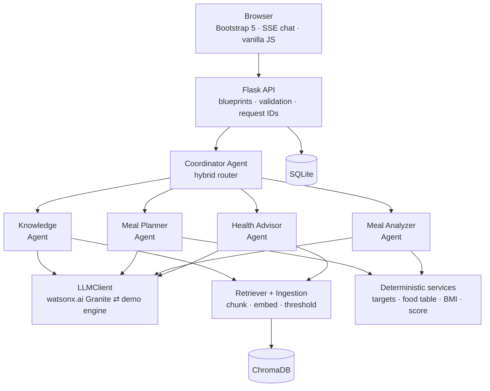
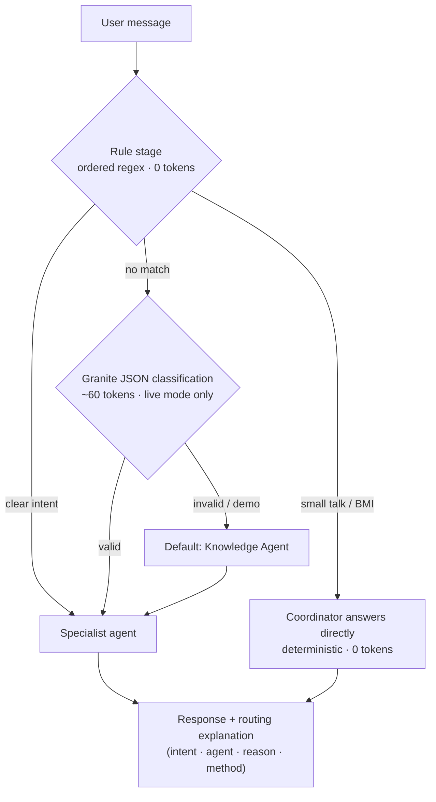
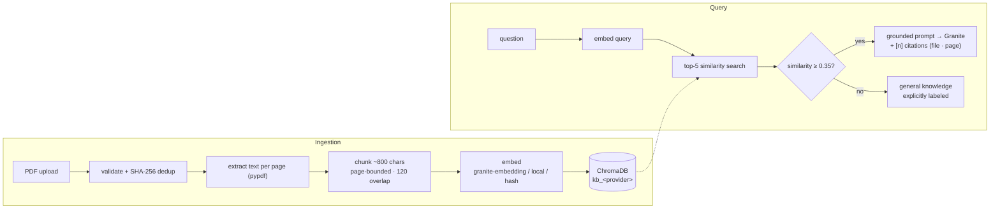
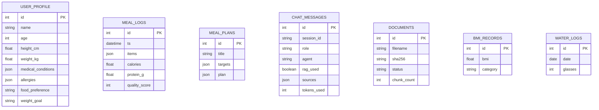
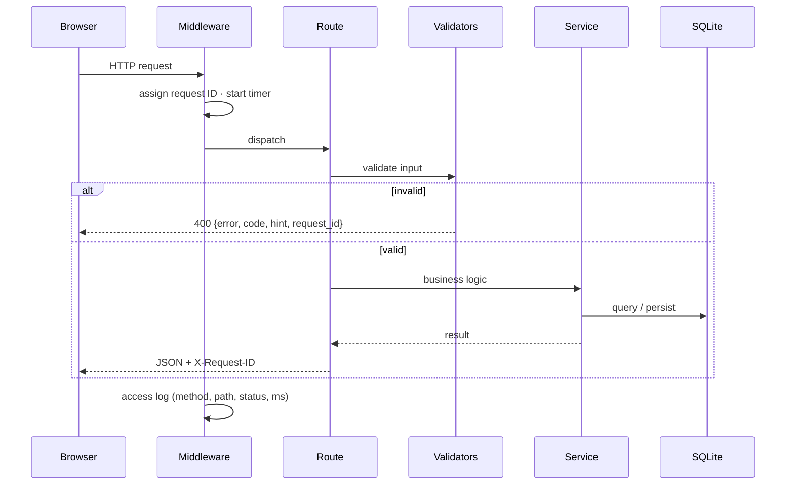
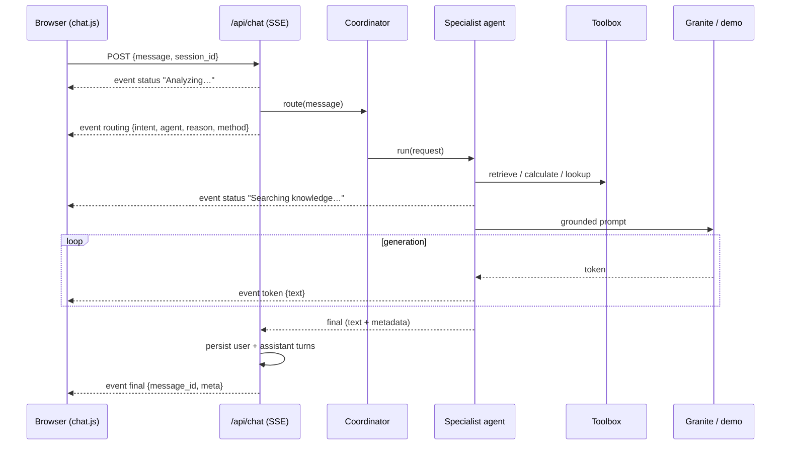

# Architecture Diagrams

Mermaid sources — GitHub renders these natively. Reused by the README,
presentation and About page.

## 1. Overall system

## 2. Agent routing

## 3. RAG pipeline

## 4. Database

*Single-profile deployment: tables are related through application logic
rather than foreign keys; the multi-user migration path adds `profile_id`
FKs (IMPLEMENTATION_NOTES.md).*

## 5. Request flow (any API call)

## 6. Chat flow (SSE)

